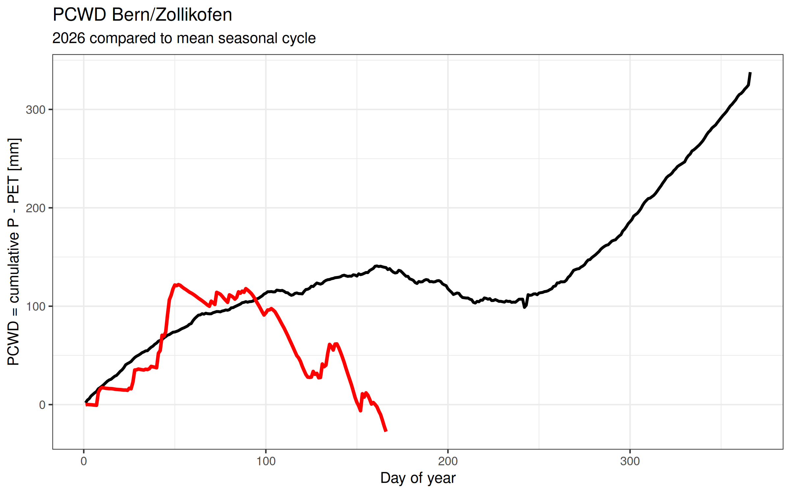
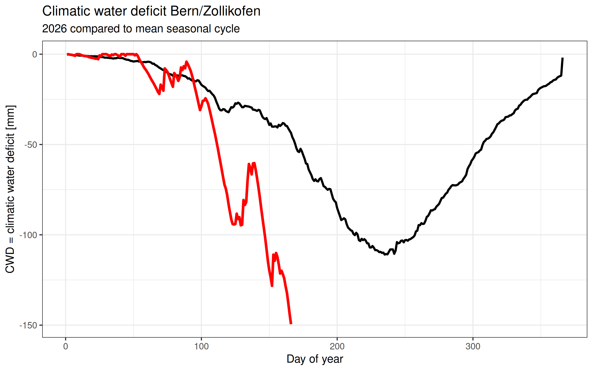

## 1. Meteorological drought

To assess current drought conditions, we compare cumulative precipitation minus potential evapotranspiration (PCWD) in 2026 against the historical seasonal cycle at the Meteo Swiss station Bern/Zollikofen. 

### PCWD

Following a relatively wet winter, conditions became progressively drier from April onwards. By mid June, cumulative precipitation no longer compensated atmospheric evaporative demand. Meaning the cumulative evaporation this year has exceeded the cumulative precipitation.

### Climatic water deficit

The climatic water deficit exceeded the historical mean already in early summer, indicating unusually strong atmospheric water demand relative to precipitation. 

## 2. Soil moisture

The SwissSMEX monitoring network provides continuous observations of soil moisture at multiple depths across Switzerland. Current conditions can be explored through to official monitoring platform:

[Open SwissSMEX Monitoring Dashboard](https://iacweb.ethz.ch/rietholzbach/SwissSMEX/Monitor/individual_stations.html){.btn .btn-primary}

For the site in Bern the soil moisture anomaly in the current year is slightly outside of the 5-95 percentile showing the current year is exceptional. It is comparable to some of the dry years of 2022 and 2023. With the warm and dry weather that is predicted for the next days soil moisture anomaly is likely the decrease even further.

## 3. Tree water deficit

TreeNet provides an overview on the current state of the tree water deficit (TWD) categorized per region and species. Currently, a large homogeneity can be observed. Some trees do not show a tree water deficit where as some others show high to very high tree water deficit. The species that currently show the most tree water deficit are Pine (Pinus sylvestris), Fir (Abeis alba), Ash (Fraxinus excelsior) and Downy oak (Quercus pubescens). The regions that are most affected are South of the Alps and the Pre-Alps. 

[TreeNet TWD Overview per Species](https://treenet.info/nowcasts/tree-signals/)

