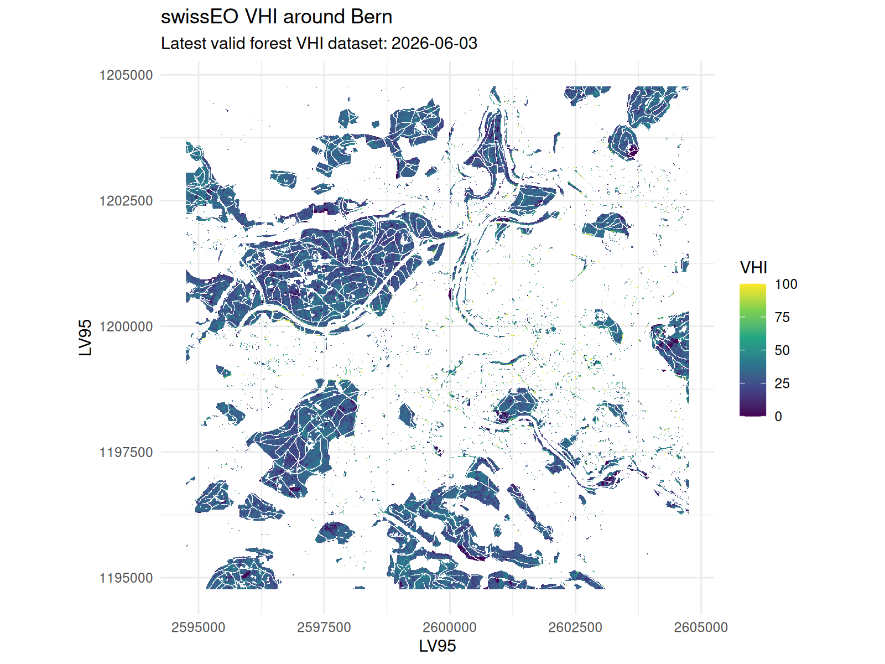

# Drought Update Switzerland – June 2026

Drought conditions have intensified across parts of Switzerland during spring and early summer 2026. A combination of below-average precipitation and increasing atmospheric evaporative demand has lead to signals of increasing drought stress since April.

This update combines several complementary indicators to assess the current drought situation: climatic water deficit derived from meteorological observations, soil moisture monitoring data provided by SwissSMEX, tree water deficit measurements from the TreeNet monitoring network and satellite-based vegetation health metrics from swissEO. Together, these datasets provide insights into how the ongoing dry conditions affect the atmosphere, vegetation, and forest ecosystems.

The figures below summarize the current state of drought stress around Bern and across Switzerland as of mid-June 2026.

## 1. Meteorological drought

To assess current drought conditions, we compare cumulative precipitation minus potential evapotranspiration (PCWD) in 2026 against the historical seasonal cycle at the Meteo Swiss station Bern/Zollikofen. 

### PCWD

The Potential Climatic Water Deficit (PCWD) provides a simple indicator of the balance between water supply and atmospheric demand. It is calculated as the cumulative difference between precipitation (P) and potential evapotranspiration (PET). Positive values indicate that precipitation has exceeded evaporative demand, while declining values indicate increasing water stress.

In the Bern/Zollikofen region, the year 2026 started with relatively wet conditions, leading to a rapid accumulation of water surplus during winter and early spring. However, from April onwards, precipitation became increasingly insufficient to offset evaporative demand. As temperatures rose and atmospheric demand increased, the accumulated surplus was steadily depleted.

By mid-June, the PCWD dropped below zero, meaning that cumulative evapotranspiration since the beginning of the year exceeded cumulative precipitation. This marks a transition from a water surplus to a water deficit situation and suggests increasing drought stress on vegetation and ecosystems.

### Climatic water deficit

The climatic water deficit (CWD) for 2026 diverged markedly from the long-term seasonal cycle. While conditions at the beginning of the year were close to average, the deficit started to increase rapidly during spring as precipitation failed to keep pace with atmospheric water demand.

By early summer, the 2026 trajectory had already fallen below the historical mean, indicating that evapotranspiration was consuming available water faster than it was replenished by rainfall. Several short precipitation events temporarily reduced the deficit, but these interruptions were insufficient to reverse the overall trend.

By mid-June, the cumulative water deficit had reached approximately −150 mm, substantially below the seasonal average of around −50 mm for the same time of year. This suggests that vegetation was exposed to considerably drier conditions than would normally be expected, providing a likely explanation for the reduced vegetation health observed in the SwissEO VHI data.

## 2. Soil moisture

The SwissSMEX monitoring network provides continuous observations of soil moisture at multiple depths across Switzerland. Current conditions can be explored through to official monitoring platform:

[Open SwissSMEX Monitoring Dashboard](https://iacweb.ethz.ch/rietholzbach/SwissSMEX/Monitor/individual_stations.html){.btn .btn-primary}

For the site in Bern the soil moisture anomaly in the current year is slightly outside of the 5-95 percentile showing the current year is exceptional. It is comparable to some of the dry years of 2022 and 2023. With the warm and dry weather that is predicted for the next days soil moisture anomaly is likely to decrease even further.

## 3. Tree water deficit

TreeNet provides near-real-time observations of tree water deficit (TWD), an indicator of the water status of individual trees. The data reveal substantial differences among species, but a common pattern emerges across Switzerland: many trees are already experiencing elevated water stress despite the relatively early stage of the summer season.

Currently, the highest proportions of trees classified as experiencing high or very high water deficit are found among Scots pine (Pinus sylvestris), silver fir (Abies alba), European ash (Fraxinus excelsior), and downy oak (Quercus pubescens). In contrast, species such as hazel (Corylus avellana) and Douglas fir (Pseudotsuga menziesii) still show a comparatively large share of individuals without measurable water stress.

Regional differences are also apparent. The southern Alps and the Pre-Alps currently exhibit the largest fractions of trees in the high and very high deficit categories, whereas the Jura and parts of the Swiss Plateau still contain a larger proportion of trees with little or no water deficit. Nevertheless, signs of water stress are present across all regions.

On the following website there is a more detailed break down of the current tree water deficit and the growth performance per species across sites in Switzerland.

[TreeNet TWD Overview per Species](https://treenet.info/nowcasts/tree-signals/)

## 4. Vegetation Health Index (VHI)

The SwissEO Vegetation Health Index (VHI) combines Sentinel-2 vegetation observations with temperature information from MeteoSwiss to provide an indication of vegetation stress. The index ranges from 0 to 100, where lower values indicate less healthy vegetation and a higher likelihood of drought-related impacts.

The map below shows the most recent VHI data available for the Bern region (3 June 2026). Forested areas are generally characterized by low to moderate VHI values, with a median value of 31 across the study area. This suggests that vegetation was experiencing noticeable stress at the beginning of June. With the warm current temperature the VHI is likely to further decrease over the coming days 

## 5. Current drought status summary

Taken together, the different indicators paint a consistent picture. Spring and early summer were characterized by increasing atmospheric water demand and below-average moisture availability. The climatic water deficit in Bern/Zollikofen has already fallen well below the long-term seasonal cycle, indicating that evaporative demand has exceeded precipitation for a prolonged period.

This signal is also reflected in the satellite-based Vegetation Health Index, which shows widespread moderate vegetation stress around Bern. At the same time, TreeNet observations reveal that many tree species across Switzerland are already experiencing measurable water deficits, with particularly pronounced stress in Scots pine, silver fir, ash and downy oak.

While current conditions are not yet comparable to the most extreme drought years on record, the combination of declining climatic water balance, reduced vegetation health and increasing tree water deficits suggests that ecosystems are entering a period of elevated drought stress. The evolution over the coming weeks will largely depend on the weather in the upcoming weeks. Currently, MeteoSwiss predicts a persistent high pressure system over central Europe with maximal daily temperatures ranging from 29-36 degrees Celsius. This will likely further increase drought stress over the coming years. 

